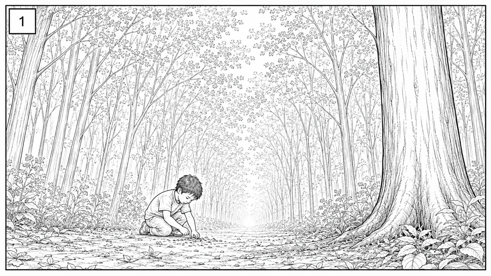
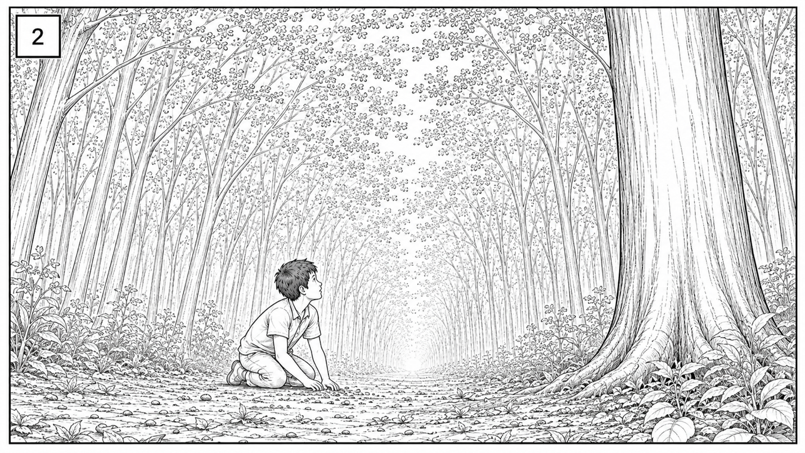
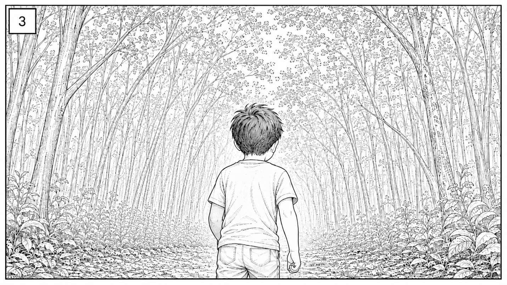

# Scene 2 — EXT. Woods/Forest — Daytime — Shoot Day Notes

**Beat 2A · BOY, alone.** BOY (7) picks up soil, thinks he hears his name, turns toward the source, then walks — pulled or searching. No dialogue, no other actor present (WOMAN only appears later, in Scene 6). This is a quiet, internal beat carried entirely by the kid's physical performance and the forest itself.

---

## Shot 1 — Picks up soil

- Establish wide, symmetrical path through the trees — check the actual location lines up before committing to this framing; re-block if the path bends.
- Direct the soil pickup as curious/absent-minded, not sad or scared — this is his "before" state.
- Mark his kneel spot on the ground (tape/stake) for continuity into Shots 2 & 3.
- Daytime forest canopy = dappled, shifting light. Shoot this fast or plan for a flat/overcast window so the light matches across all 3 shots.

## Shot 2 — Hears his name, looks up

- This is the pivot beat — get the kid's reaction right: a slow, uncertain turn, not a startled snap. Do a few takes at different speeds.
- Decide now: will someone off-camera call his name for him to react to, or is he acting it blind? Line up your off-screen cue (a crew member or playback) before rolling.
- Match eyeline — where is "the source" supposed to be? Pick a fixed point in the trees and stick to it across takes so it can be found in the edit.
- Keep his body position consistent with where he knelt in Shot 1 (same tape mark).

## Shot 3 — Walks toward the source

- Shot from behind — walking pace matters more than face here. Rehearse the pace (slow/searching vs. drifting/pulled) before rolling.
- Confirm walking path is clear of roots/debris for a real 7-year-old to walk safely without looking down at his feet.
- Continuity: same wardrobe, same dirt/soil on hands if visible, same hair state as end of Shot 2.
- This shot needs to lead somewhere — check where camera/action picks up next (Scene 4/6, boy arriving at the clearing) so the exit direction of frame matches.

---

## General notes for this scene
- **No dialogue, no other cast** — this scene lives or dies on kid performance + blocking. Budget extra takes/patience.
- **Continuity across shots**: soil on hands, kneel mark, hair, wardrobe — small forest scene, small details show.
- **Light**: forest daylight changes fast under canopy — if shooting non-continuously, note time of day/light condition per shot so you can match or explain drift.
- **Sound**: wide forest = wind, birds, rustling leaves; if you need quiet for a future ADR pass or for the "hears his name" beat, do a room-tone/ambience take.
- **Safety**: uneven ground, roots, low branches — walk the path with the kid (and guardian) before rolling for the walking shot.
