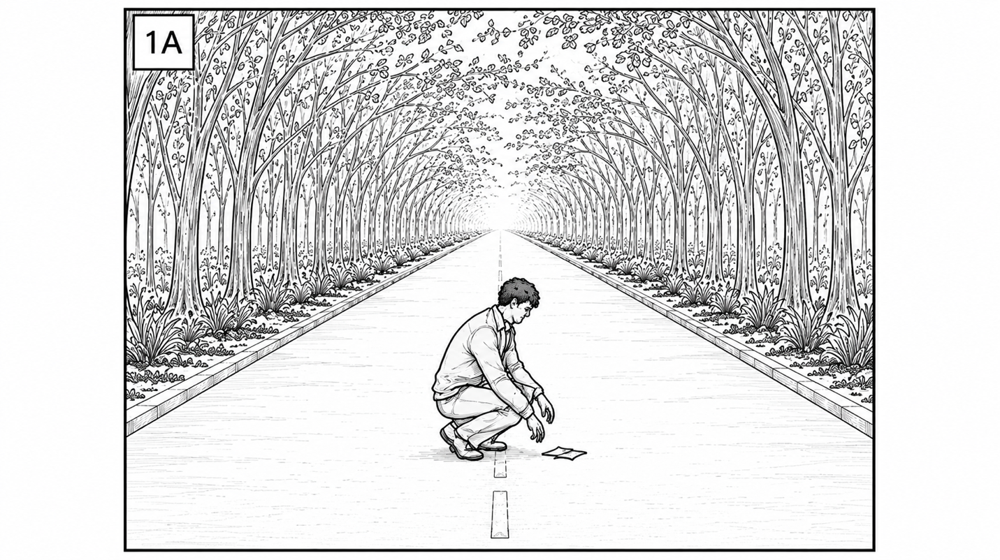
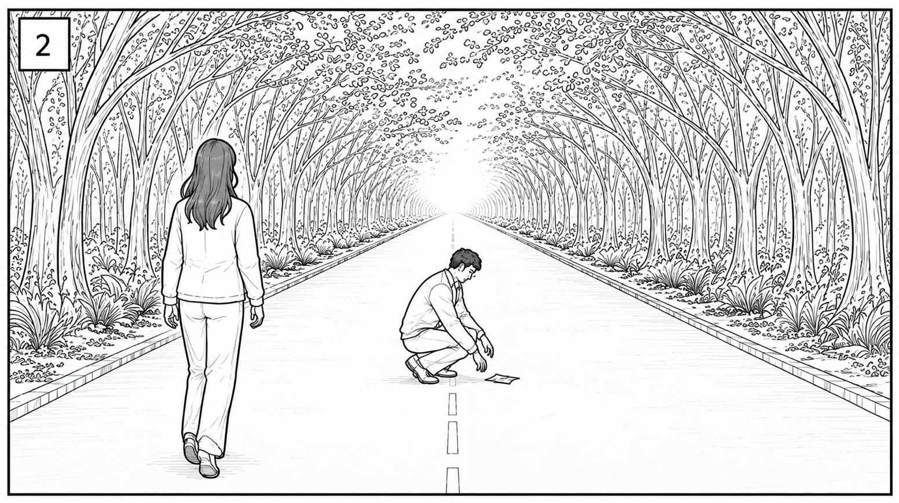
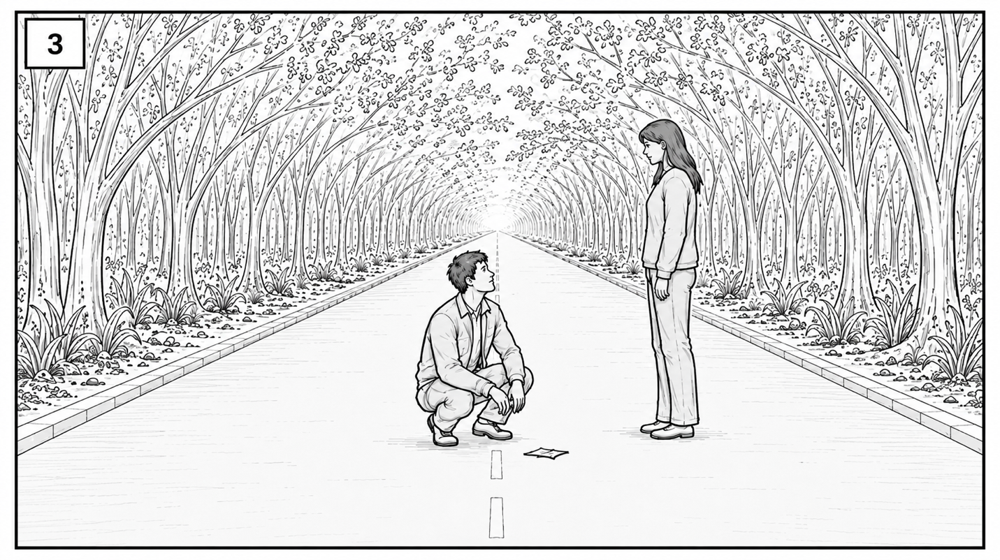
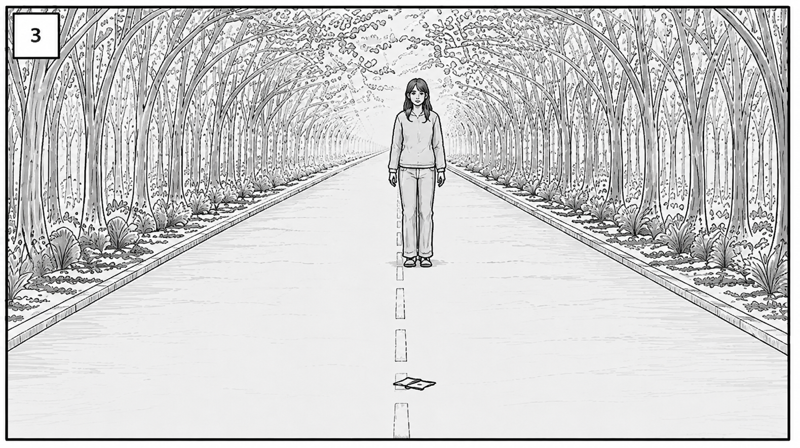
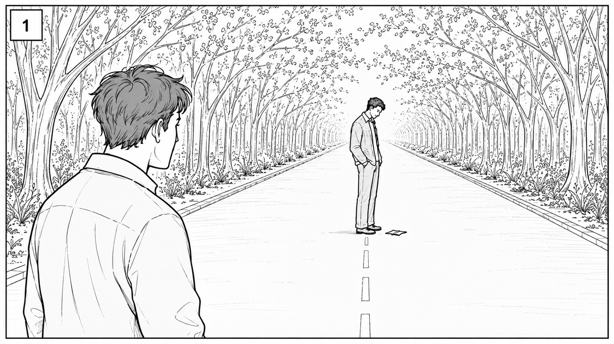

# Scene 3 — EXT. Park Road — Moments Later — Shoot Day Notes

**Picks up right where Scene 1 left off**: wind took MAN's sheet of PAPER, he chased it down, WOMAN slowly followed. Scene 3 opens with him retrieving it off the road, then the two fall into step and talk (train story, "I misspoke," half-mile-home beat).

- **3A · Train story / "I misspoke"** — MAN pockets his LIGHTER. WOMAN tells the train/delay story, MAN catches her contradiction (she said Keokuck earlier), she deflects ("I misspoke"). Walk in silence, then she finishes the story. "Feels like fate, no?" / "I am indifferent to fate."
- **3B · Half-mile home / small beauty** — MAN: "A half-mile walk isn't too far, if it takes you home." WOMAN: tiredness line. Both look up, notice something (tree/bird) — this is the button that leads into Scene 4 (BOY in the woods, VO carries over).

---

## Shot 1 — MAN kneels alone, retrieves the paper

- The PAPER prop needs to match exactly what flew away in Scene 1 (same fold/crumple) — shoot Scene 1's wind gag and this pickup close together, or lock the prop copy count so they're identical.
- Mark his kneel spot on the centerline — this is also your line-up mark for Shots 2 & 3.
- He should look a little winded/sheepish from the chase — small character beat, not deadpan.

## Shot 2 — WOMAN approaches from behind

- Block her walking pace to arrive right as he stands — rehearse the timing so dialogue can start clean without dead air or overlap.
- Her jacket (mother's jacket, referenced again in 5G) and book need to be on her/visible now — first appearance of both props, so lock how she's carrying them here for continuity through Scenes 5 and 7.

## Shot 3 — Face to face, dialogue starts

- This is where "You said you came from Keokuck..." / "I misspoke..." lands — keep it low-key, no big reaction, it's a throwaway lie she brushes past.
- Eyeline: he's still kneeling/low, she's standing — decide if he stands mid-line or stays down a beat longer. Pick one and repeat it for every take.

## Shot 4 — WOMAN alone on the road

- Wide/clean plate option — useful if you want a beat of her alone before he's back in frame, or as a reverse/insert if the two-shot doesn't cut well.
- Note whether MAN is meant to be out of frame here (stepped aside) — if so, mark his off-camera position so eyelines stay consistent when he re-enters.

## Shot 5 — Alternate angle / OTS

- Different coverage angle for the same moment — decide on set whether you actually need this setup or if Shots 1–3 already cover it; don't burn light/time on redundant coverage.

---

## Continuity checklist for this scene
- **Paper prop**: same fold as the one that flew away in Scene 1. Bring spares that are pre-folded identically.
- **Lighter**: MAN pockets it at the top of the scene — make sure it's in the same pocket/hand as established in Scene 1's cigarette beat.
- **WOMAN's jacket + book**: both established here, both referenced later (Scenes 5 & 7) — note exactly how she wears/holds them for matching later.
- **Walking pace**: 3A is a moving/talking scene — rehearse the two-shot walk-and-talk blocking (mic/boom will need to travel with them) before rolling.
- **3B's "look up" beat**: decide now what they're actually looking at (tree, bird, light) so the eyeline is real and matches into Scene 4's canopy imagery.

---

## Lighting — Keeping the Sun Consistent

Your instinct is right: direct sun through tree canopy (Scenes 2, 3, 4, 6 are all under trees) is the #1 way to lose a matched look — dappled hot spots on faces, shots swinging warm-to-cool as clouds pass, one side of the road in sun and the other in blue shade. Here's how to control it:

- **Overhead diffusion is your main tool.** Rig a silk/griffolyn (6x6 or 8x8 for close work, 12x12/20x20 for a wider area like the road) on butterfly frames over your actors. This turns harsh direct sun + dappled leaf-shadow into one soft, even light — like your own portable overcast sky. This alone solves 90% of the "sun coloring things differently" problem.
- **Bounce/fill boards** (white and silver reflectors, 4'x4' or 6'x6') to lift shadows on faces without changing color temp — cheaper and faster than diffusion for a quick face-fill.
- **Negative fill** (black duvetyne/floppy) on the opposite side when you want more contrast/shape instead of flat light — useful for the more emotionally weighted beats (5B, 5E, 7D).
- **Lock white balance manually** on camera per setup (custom WB off a gray/white card) — never leave it on auto. Auto WB will drift shot to shot as clouds move or as you turn between sun/shade, which is exactly the "different colors" problem you're describing.
- **ND filters** (a variable ND or a set of fixed NDs) so you can shoot at a workable aperture in bright sun without overexposing.
- **A small top-up light** (battery LED panel like an Aputure or a compact HMI, gelled with CTO to match daylight ~5600K) held at the same angle as the sun. When real clouds roll in and steal your sun, this keeps the key light direction/color consistent instead of shots going flat.
- **C-stands, sandbags, Cardellini/tree clamps** — in the woods you'll often rig diffusion or flags off branches rather than stands, so bring extra rigging clamps and rope in addition to stands.
- **Schedule around match, not convenience**: shoot all the coverage for one scene/setup inside as tight a time window as possible. Sun angle and color temperature shift fast (especially mid-morning to midday), so a scene shot over 3 hours will visibly mismatch even with the same diffusion setup.
- **Overcast days are a gift, not a problem** — if the forecast turns cloudy, take it; even skin tones and no dappling means less rigging. Keep the diffusion kit on standby either way since weather can flip mid-shoot-day.

**Minimum kit to bring:**
- 1–2 silk/diffusion frames (6x6 + 12x12) + butterfly stands/poles
- 2–3 C-stands + sandbags + a couple of Cardellini clamps for tree-rigging
- White/silver reflector (collapsible 5-in-1 is fine for close coverage)
- 1 black flag/floppy for negative fill
- ND filter set or variable ND for camera
- Gray card/white card for manual WB
- 1 battery-powered LED or small HMI + CTO gel, as a consistent top-up key
